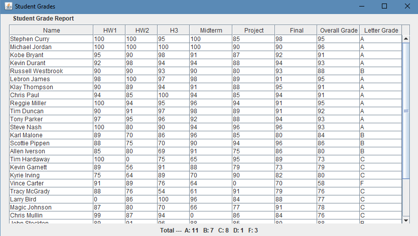

# Student Grade Project

All code written in Java with the Eclipse IDE.

The goal of this project was to ingest a group of student grades stored in a text file, and present them in a tabular GUI form while also producing a final grade for the student. The "students" for the course are famous NBA basketball players - the professor had a good sense of humor!

Both projects required the use of both object-oriented and generic programming principles and techniques, such as class discovery, inheritance, polymorphism, and further provided the projects provided a good experience in managing a project under a deadline.

 
